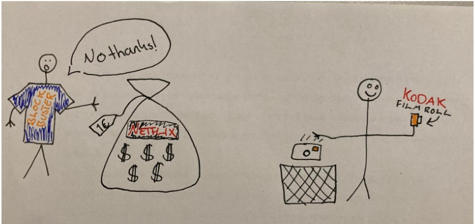
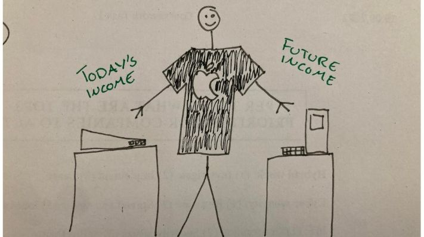
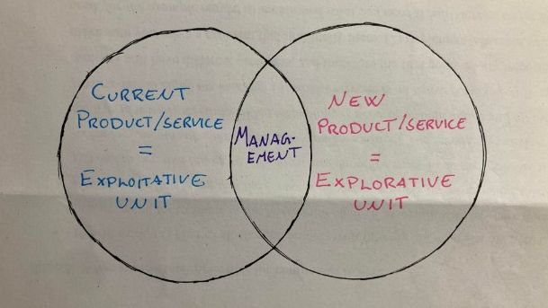

> Amanda's blog for blended learning 

# Ambidextrous organizations 

We have many examples of organizations that were once large and powerful, who have failed to succeed in the modern world. Maybe the most famous one is Kodak who actually was the one to develop the digital camera, but decided to stick with what they know thinking the digital camera was not worth investing in. Or the one time home movie industry leader Blockbuster offering people to rent DVDs. Blockbuster was offered to buy Netflix which at the time was a new concept, but they declined. 

What was the biggest mistake of these and many other companies, or what could they have done to succeed? One road to success is managing to be an Ambidextrous organization. 

## What is an Ambidextrous organizations? 

The word ambidextrous itself means being able to use both hands equally well(1). For an organization to be an ambidextrous organization it means being able to attend to their products at the same time as they are innovating for the future(2). No company succeeds forever, so if you are not the one to make the product that kills your company, somebody else will!   

One company that has succeeded being ambidextrous is Apple. Early on Apple had the Apple 2e which made a lot of money, then Steve Jobs came back and built the Macintosh. Therefore at the same time you had the old Apple 2e and the modern Macintosh. Where Apple 2e was milking the current market and the Macintosh was an invention. Making 2e responsible for Apple's income at the time, keeping the company alive, and creating money used on developing the macintosh. Apple managed to be an ambidextrous organization, if they had decided to “stick with what works” and only focused on the 2e we can assume they would not have been alive today. 

## How does it work?

According to [O’Reilly and Tushman (2004)](https://hbr.org/2004/04/the-ambidextrous-organization) managers need to be able to attend to their products at the same time as they are innovating for the future(3),  just like Apple did with the Apple 2e and the Macintosh. In other words they need to be able to explore at the same time as they exploit. Which may sound like an easy thing to do, but a lot of companies fail to be ambidextrous even if they are aware they should be.  O’Reily and Tushman (2004) takes a look at the theories, some say that you need cross-functional teams, others say you have to alternate between focusing on old and new. 

O’Reily and Tushman (2004) found that companies who have indeed succeeded at being ambidextrous share some characteristics. The main one being: They separate their explorative and exploitative units. 

This means doing incremental and discontinuous innovation at the same time. An incremental innovations is a stepwise or a small improvements to your product(4), while a discontinuous innovation is about introducing an entirely new product to the market(5). Where the breakthroughs or the discontinuous innovations come from a structurally independent unit in the organization. In general O’Reily and Tushman (2004) found that breakthroughs coming from ambidextrous organizations were way more often successful than breakthroughs coming from organizations with other structures. 

## Why does it work? 

From a theoretical perspective ambidextrous organizations work better because their structure allows the organization to “cross-fertilization among units while preventing cross-contamination” O’Reily and Tushman (2004). Which means they can share what benefits them both like knowledge, customers or income. At the same time the new and explorative unit is not contaminated by the old way of thinking for the company. In addition the old unit is not affected by distractions coming from the explorative unit trying to launch a new business(6).

---
### Sources
- (1) https://dictionary.cambridge.org/dictionary/english/ambidextrous
- (2) https://hbr.org/2004/04/the-ambidextrous-organization 
- (3) https://hbr.org/2004/04/the-ambidextrous-organization 
- (4) https://www.northeastern.edu/graduate/blog/what-is-incremental-innovation/#:~:text=The%20term%20%E2%80%9Cincremental%20innovation%E2%80%9D%20refers,while%20building%20on%20current%20offerings.
- (5) https://www.oxfordreference.com/view/10.1093/oi/authority.20110803095721272#:~:text=An%20entirely%20new%20product%20introduced,no%20previous%20product%20has%20performed
- (6) https://hbr.org/2004/04/the-ambidextrous-organization 

---
---
---

# THE OLD BLOG: 
---
---
---

## What does Ambidextrous mean?

Ambidextrous is defined by [Cambridge Dictionary](https://dictionary.cambridge.org/dictionary/english/ambidextrous) as being able to use both hands equally well. 

---

## So what does it mean when an organization is Ambidextrous? 

For an organization to be ambidextrous it needs to be able to both be efficient doing what it does to day,
at the same time as it is innovating for the future. 

---

## What do we want to know about ambidextrous organizations? 

### THE APPLE EXAMPLE
- Look at Apple, and the book of Steve Jobs
    - At the time it was the apple 2e which Apple made a lot of money on, then Steve Jobs came back and built the Macintosh
    - So at the same time you had the old apple 2e and the more modern
    macintosh 
    - Which means Apple was ambidextrous, milking the market with apple 2e
    and innovating with the macintosh 
    - Apple needed the apple 2e for income and keeping the     company alive, but they also needed to develop the macintosh, otherwise they probably would not have been alive today 

How does an organization both do what is keeping them alive and innovate at the same time? 

---

## A Harvard Business Review  article on Ambidextrous Organizations 

Source: O’Reilly, C.A. & Tushman, M.L. (2014). The Ambidextrous Organization. Harvard Business Review. [Link](https://hbr.org/2004/04/the-ambidextrous-organization) 

The article states that:
- Managers need to be able to attend to their products at the same time as they are innovating for the future
- Or in other words explore the new at the same time as exploiting the old
- A famous example of how not to do it is Kodak whom made the digital camera, but decided to stick with what they knew, and not to use more time on the digital camera, as we all know that did not go very well. 

- A lot of companies fail to be ambidextrous, but what is the success formula? 
- Some say it is cross-functional teams, other say you alternate between focusing on old and new
- O’Reilly and Tushman (2014) tests the theories!

---

## Sucsessfull Ambidextrous Organisations according to [O’Reilly and Tushman, 2014](https://hbr.org/2004/04/the-ambidextrous-organization)

- They found that companies being successful, at being ambidextrous, share some characteristics, the main one being: 

> They separate their explorative and their exploitative units.

---

## Beeing explorative and exploitative at the same time [O’Reilly and Tushman, 2014](https://hbr.org/2004/04/the-ambidextrous-organization)

- To be explorative and explorative at the same time, a company needs to do incremental and discontinuous innovations at the same time.
- Where breakthroughs from Ambidextrous organizations came from structurally independent units in the organization.
    - Where structurally independents means that they have their own processes and their own culture. Almost like a new organization within the organization. 
- They also found that breakthroughs coming from ambidextrous organizations where way more often successful than with the other structures. 

---
 

> " At a theoretical level, it’s easy to explain why ambidextrous organizations would outperform other organizational types. The structure of ambidextrous organizations allows cross-fertilization among units while preventing cross-contamination. The tight coordination at the managerial level enables the fledgling units to share important resources from the traditional units—cash, talent, expertise, customers, and so on—but the organizational separation ensures that the new units’ distinctive processes, structures, and cultures are not overwhelmed by the forces of “business as usual.” At the same time, the established units are shielded from the distractions of launching new businesses; they can continue to focus all their attention and energy on refining their operations, improving their products, and serving their customers" -  [O’Reilly and Tushman, 2014](https://hbr.org/2004/04/the-ambidextrous-organization) 

That's in theory, how does it work in practice?

---

## Disruptive innovations

Why is there a need to be Ambidextrous? The need to be ambidextrous may come from what we define as Disruptive innovations. 
[Simply explained disruptive innovation](https://www.youtube.com/watch?v=Cu6J6taqOSg) 

---

