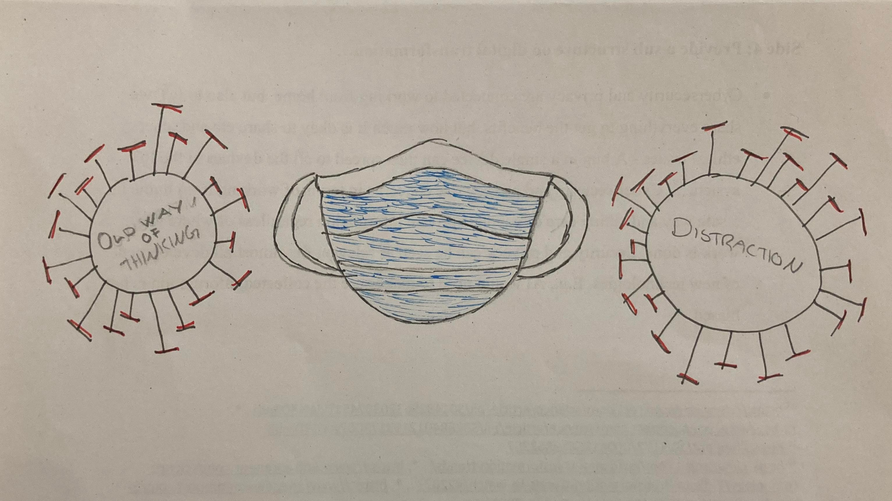
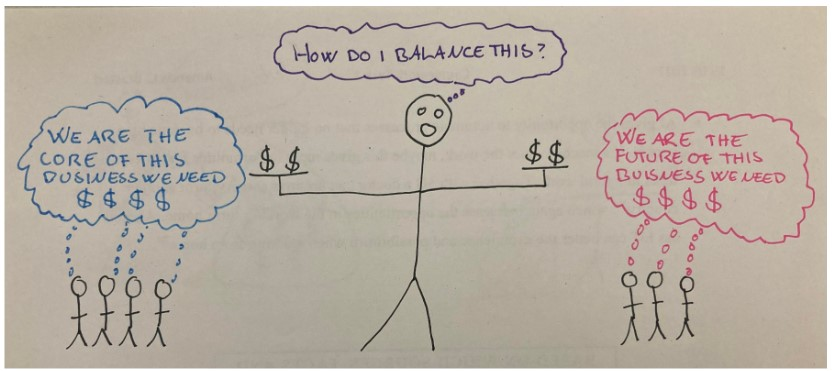
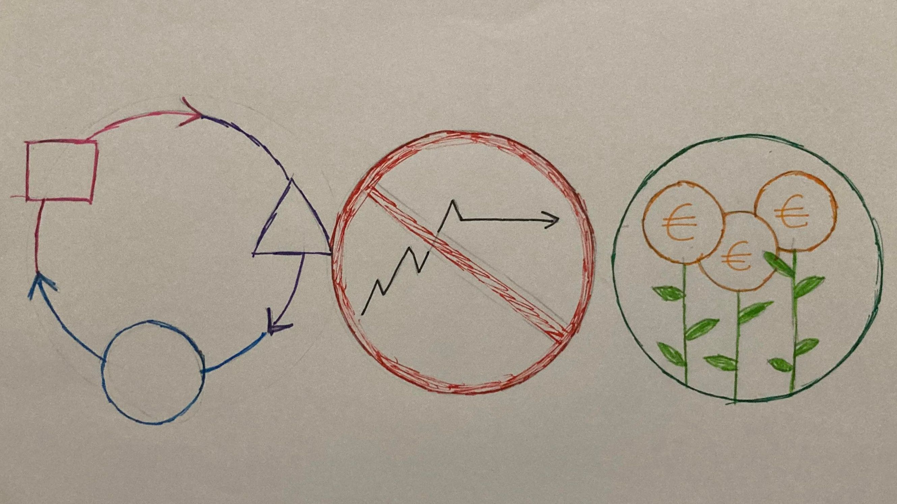

#  Ambidextrous organizations

by Amanda Brastad 

> Ambidextrous: Being able to use both hands at the same time!

---
## Introduction 

1. Why is Ambidextrous organizations interesting?
2. What is organizational ambidexterity? 
3. How does ambidextrous organizations work? 

---
## WHY IS IT INTERESTING?

Ambidexterity is the recipe for success

---
## WHY IS IT INTERESTING?

Ambidexterity is the recipe for success

---
## WHAT IS Ambidextrous organizations?

* Attending to your current products at the same time as you are innovating for the future 
* No company succeeds forever, if you are not the one to make the product that kills your company, somebody else will!   

---
## HOW DOES IT WORK?

Explore and exploit at the same time

---
## HOW DOES IT WORK? 
**Why does explore and exploit work**

Avoids cross-contamination allows cross-fertilization

---
## HOW DOES IT WORK? - The problems

* innovators dilemma 
* Challening to lead both units 

---
## HOW DOES IT WORK? - The problems and Tools

| **Problems**                 | **Tools**                           | 
| :---------------------------:|:-----------------------------------:| 
| Conflict of resourses        | Balance communication               | 
| Risk of contamination        | Right people in the right place     | 
| Expensieve                   | Right resourses in the right plase  |   
| People are opposed to change | Be allowed to fail & explore        |   

---
## HOW DOES IT WORK? - The problems
The real problem is balance 

---

## What is then needed to succeed in being ambidextrous? 
* The right setup trough separate units in the organization 
* The right leaders with mindset and skills to lead both teams 
* A team with the right training and motivation to invent
* Balancing the exploration and exploitation

---
## The benefits if you succsed 

* Adaptability 
* Avoid stagnation 
* Long term profit 

---
## Recap 

* Short answer for each question! 
1. Why is Ambidextrous organizations interesting
2. What is organizational ambidexterity? 
3. How does ambidextrous organizations work? 

---

> Sources can be found in my [blog on Ambidextrous organizations](https://github.com/amandabrastad/2022ws_do_ab/blob/main/bl_blog_do.md)

