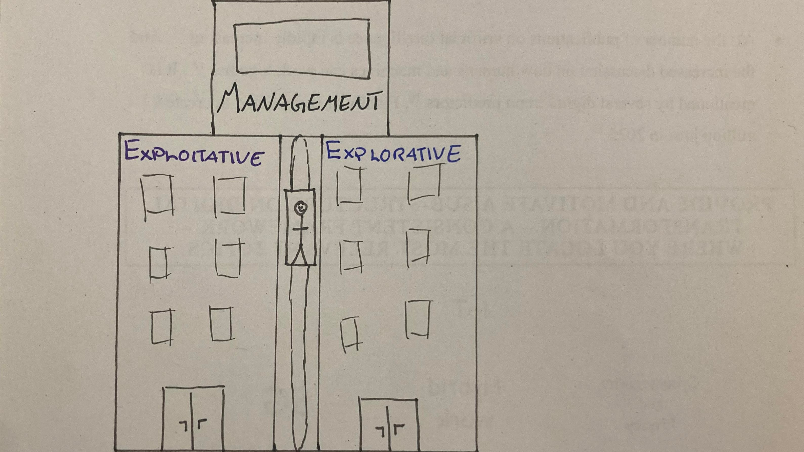

#  Ambidextrous organizations

by Amanda Brastad 

> Ambidextrous: Being able to use both hands at the same time!

---
## Introduction 

1. Why is Ambidextrous organizations interesting?
2. What is organizational ambidexterity? 
3. How does ambidextrous organizations work? 

---
## WHY IS IT INTERESTING?

Ambidexterity is the recipe for success

---
## WHY IS IT INTERESTING?

Ambidexterity is the recipe for success

---
## WHAT IS Ambidextrous organizations?

* Attending to your current products at the same time as you are innovating for the future 
* No company succeeds forever, if you are not the one to make the product that kills your company, somebody else will!   

---
## HOW DOES IT WORK?

Explore and exploit at the same time

---

- What is it needed for? 
* The benefits 
* Example (Apple)

---
## HOW DOES IT WORK?

- Concrete answers, how does one do it?
- How do you do both innovation and stay in the market?

* In depth of ambidexterity

---
## Recap 

* Short answer for each question! 
1. Why is Ambidextrous organizations interesting
2. What is organizational ambidexterity? 
3. How does ambidextrous organizations work? 

---

> Sources can be found in my [blog on Ambidextrous organizations](https://github.com/amandabrastad/2022ws_do_ab/blob/main/bl_blog_do.md)

